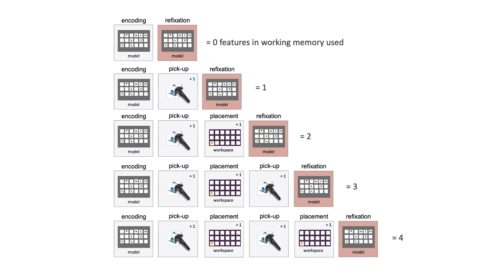

# Overview


This pages provides an overview of the task, all included conditions and core metrics. To download the task, go to `Github <https://github.com/DejanDraschkow/ObjectCopyingVRTask>`or follow the instructions in :ref: `Getting Started`. 

### Object Copying Task

This documentation details information of the temporally extended “object-copying task”  (Ballard, Hayhoe, & Pelz, 1995) - re-invented in Virtual Reality (VR). In this task, participants are instructed to copy a Model display by selecting objects from a Resource pool and placing them into a Workspace (Figure 1A). Moving one object at a time, participants would look at the Model to encode a to-be-copied object, rotate to the Resource area, search and pick up the correct object and place the object in the Workspace (Figure 1B) – creating a task environment that closely mirrors the demands of natural behaviour. 


What sounds complicated at first is probably best illustrated by putting yourself in the participant’s shoes: 

.. raw:: html
    <div style="position: relative; padding-bottom: 56.25%; height: 0; overflow: hidden; max-width: 100%; height: auto;">
        <iframe src="//www.youtube.com/embed/dQw4w9WgXcQ" frameborder="0" allowfullscreen style="position: absolute; top: 0; left: 0; width: 100%; height: 100%;"></iframe>
    </div>


Natural behaviour is a complex system which comprises individual cognitive components interacting in a sophisticated fashion. Leveraging the advantages of VR, the task allows to capture a range of interwoven cognitive functions that are involved in real-world task - such as working memory, sensorimotor decision making,  attentional  allocation,  and  action  planning.  Here, VR allows for the detailed recording of participant’s behaviour by allowing full control over participants’ entire field of view, full information about the experimental environment as well as access to participants’ eye, hand and body movements, and their position in space. 

### Task Conditions

The version of the task documented here contains two key manipulations (also see video above). 

#### 1. Spatial arrangement of VR environment
We introduce different locomotive demands (high vs. low) by changing the distance between the Model and Workspace/Resource (90° vs. 0°). In the high locomotive demand condition, sampling information from the Model requires more movement and rotation. Across multiple versions of the task, it has been shown that increasing locomotive demands reliably shifts important task metrics (e.g. working memory usage) and therefore enables to investigate how behaviour is adapted in the light of different environmental demands (e.g. Draschkow et al. 2021). 

#### 2. Distractor visibility in Resource area
Completing the task requires participants to search for target objects among distractors in the Resource area. Here, we manipulated the visibility of distractors by making distractors more transparent (high vs. low visibility). In the high visibility condition, distractors and target transparency is equal. In the low visibility condition, distractor transparency is increased by 80%. 


```{admonition} Note
:class: warning
Pointers on how to add/remove conditions can be found in (changing task parameters)[https://objectsorting-docs.readthedocs.io/en/latest/Unity/Changes.html] and (User journeys)[https://objectsorting-docs.readthedocs.io/en/latest/User/MinorChanges.html]. 
 
```

### Important Metrics

Participants behaviour is recorded on a frame-by-frame basis, resulting in a detailed and multivariate data set. Here, a few important metrics are highlighted and a more in-depths overview of available metrics and variables can be found at (Data Logging)[https://objectsorting-docs.readthedocs.io/en/latest/Unity/Behind/DataLogging.html] and (Preprocessing)[https://objectsorting-docs.readthedocs.io/en/latest/PreProcessing/Quickstart.html]. 

#### 1. Working Memory Usage

The correct placement of each target object requires the usage of two features: its identity for pickup and its location for placement. These features have to be held in mind to complete the task, as both pickup and placement require moving away from the Model. Combining knowledge of the task structure with gaze measures can therefore provide an implicit proxy for WM usage. Dividing task behaviour into sequences that start and end with sampling information externally from the Model (Figure 2), allows to quantify the number of features that have been used to guide behaviour in between. For example, successfully picking up a target object after sampling this information indicates that one feature (i.e., object identity) has been used in WM. If a participant places the object in the Workspace without looking back to the model, a second feature (i.e., object location) has been used. During another example, participants could place the object and select and place an additional object from the resource without having looked back at the model, indicating they retained the identity and locations of two objects (4 features).



#### 2. Encoding/ Sampling Information

Sighted humans gather critical visual information by regularly moving their eyes to relevant locations (Henderson, 2003). Consequently, gaze position has been linked to memory processes such as encoding (Ballard et al., 1995; Damiano & Walther, 2019; Droll & Hayhoe, 2007; Theeuwes, Belopolsky, & Olivers, 2009), and gaze dynamics can be used as a proxy for the on- and off-set of a memory encoding episode (Draschkow et al., 2021; Peacock et al., 2021). 
In this VR task, gaze on the Model is therefore used as a proxy for encoding. This will allows to quantify aspects of encoding such as what, how long, how much, and in which order information has been sampled. Given the temporally extended nature of the task and the option to revisit the Model, this also allows to capture how participants dynamically sample information over time.

#### 3. Search Behaviour

Picking up a correct target object requires searching for it in the Resource area. Gaze on objects in this area can therefore give insight on participants’ search behaviour and allows to quantify aspect such as how many, how long and which objects have been looked at during search.  Additionally, this can be related to other aspects of the task. 

#### 4. Task Performance

Lastly, task performance can be measured on both trial (e.g. trial completion time) and feature (time taken to complete one feature) level. 


### References 

Ballard, D. H., Hayhoe, M. M., & Pelz, J. B. (1995). Memory representations in natural tasks. Journal of Cognitive Neuroscience, 7(1), 66–80. https://doi.org/10.1162/jocn.1995.7.1.66 

Damiano, C., & Walther, D. B. (2019). Distinct roles of eye movements during memory encoding and retrieval. Cognition, 184(December 2018), 119–129. https://doi.org/10.1016/j.cognition.2018.12.014

Draschkow, D., Kallmayer, M., & Nobre, A. C. (2021). When Natural Behavior Engages Working Memory. Current Biology, 31(4), 869-874.e5. https://doi.org/10.1016/j.cub.2020.11.013 

Droll, J. A., & Hayhoe, M. M. (2007). Trade-offs Between Gaze and Working Memory Use. Journal of Experimental Psychology: Human Perception and Performance, 33(6), 1352–1365. https://doi.org/10.1037/0096-1523.33.6.1352

Henderson, J. M. (2003). Human gaze control during real-world scene perception. Trends in Cognitive Sciences, 7(11), 498–504. https://doi.org/10.1016/j.tics.2003.09.006 

Peacock, C. E., David-John, B., Zhang, T., Scott Murdison, T., Boring, M. J., Benko, H., & Jonker, T. R. (2021). Gaze Signatures Decode the Onset of Working Memory Encoding. In 2021 CHI Workshop on Eye Movements in Cognitive State (CHI ’21). Association for Computing Machinery. 

Theeuwes, J., Belopolsky, A., & Olivers, C. N. L. (2009). Interactions between working memory, attention and eye movements. Acta Psychologica, 132(2), 106–114. https://doi.org/10.1016/j.actpsy.2009.01.005 


