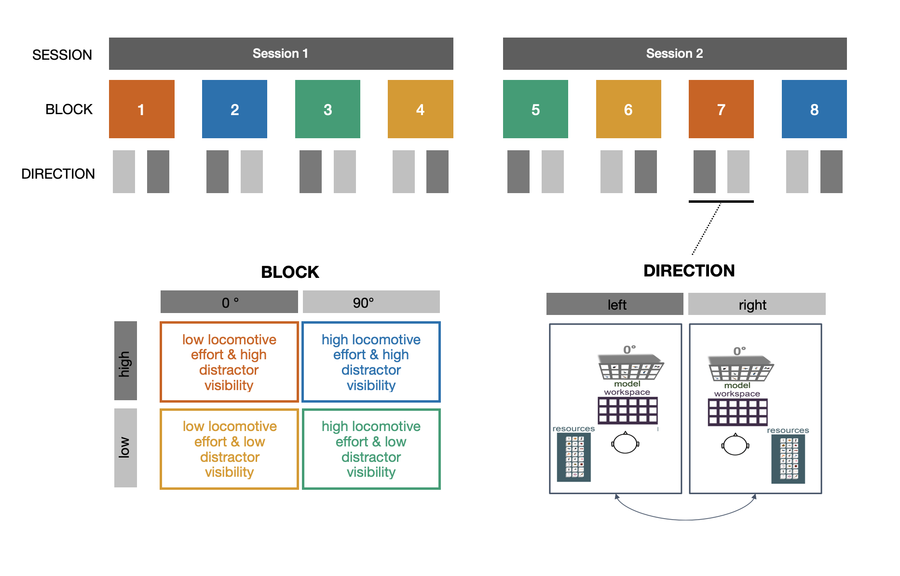

(Quickstart)=

# Getting Started


```{eval-rst}
    .. toctree::
        :titlesonly:
        :hidden:
        :maxdepth: 1 
        
    
        Start/Interface.md
        Start/Structure.md

```

After reading this section you will be able to download and set up the task. It also provides a first overview of the Unity interface and project structure, which should enable you to run and replicate the experiment as well as give you a first idea of how to adapt the task to different research questions. 

## Technical requirements
First things first: Which software and hardware is required to run this task? 
The task shared here relies on a **HTC Vive Tobii Pro VR headset** with a **built-in binocular eye tracker** and one **Vive Pro Controller**.  However, this could be adapted to a different VR system if necessary. Locations of the headset and the hand-held controller are tracked using **two Vive lighthouse base stations**. The virtual environment is presented and rendered with **Unity (Version: XXX)**. The environment consists of a 450 x 450 cm room with a ceiling height of 240 cm. While participants are unlikely to move around the entire virtual space, making sure to set up the task in a **large enough physical space** is advisable for participant safety.


## Download Task
The task is available for download at [GitHub](https://github.com/DejanDraschkow/ObjectCopyingVRTask).  

Feel free to use it or make it your own!

## Task Structure & Details

Before going into detail about specific task parameters in Unity, this section this section will first cover the task structure and details. 
Given the length of the task (~ 2 hours with preset trial number), it is divided into two close to identical sessions (see Figure below). Session 1 includes a practice phase (4 trials, one trial in each combination of conditions). Each session needs to be initiated by the experimenter and will result in a separate data file. This is done to A) force the participant to take a break and B) protect against technical failures. Each session includes 4 blocks with all combinations of conditions to ensure observations in each of them in the face of technical failure in one of the sessions. Block order is randomised within in each session. Additionally, each block is divided into 2 “sub-blocks”to account for rotation direction (i.e., rotating to the left or right in order to find the Resource area). Again, the order of sub-blocks is randomised within each block and each sub-block consists of 7 trials. Consequentially, each session includes 56 trials (= 98 trials in total, 32 in each combination of conditions).



#### Experimental flow
Participants progress through the experiment by alternating between an Instruction Room and the Trial Room. Model, Workspace and Resource area are removed in the Instruction Room. Instead, text is displayed on one of the walls and a blue square appears in the middle of the ground. 
Before each new sub-block, the eye-tracker is calibrated using the build-in calibration procedure. Afterwards, instructions on the arrangement of the Model and Resource area are displayed (i.e. where will the participant find the Model and Resource?). Participants can advance to the “next room” by stepping on the blue square and pressing the grip button on the controller.  After reading the instructions, participants are asked to rotate towards where the Model will appear. This is done to ensure a consistent starting position where participants always enter the Trial Room facing the Model. A fixation cross is displayed on the wall behind where the Model will appear. Participants can then advance to the next trial in the Trial Room by pressing the grip button while fixating the fixation cross and standing on the blue central square. 
Once inside the Trial Room, participants have 45 seconds to successfully copy all 8 objects shown in the Model. Participants can only pick up and carry one object at a time with their controller, which imposed a sequential order into the task. The picked-up object then needs to be placed in the appropriate location of the Workspace. Once the participant successfully placed the object, the location was highlighted with green contours. Red contours would signal to the participant if the wrong location was chosen. The objects in the Resource would be rendered invisible as long as an object was placed incorrectly in the Workspace, thus making it impossible for the participant to continue until the object was either placed correctly, or removed from the Workspace (e.g., an incorrect object was moved to begin with). 
After either completing the trials or running out of time, participants are placed back into the Instruction Room automatically. They are then asked again to rotate towards the fixation cross and start the next trial by pressing the grip button while fixating the fixation cross and standing on the blue central square. 


Next: Navigating the Unity interface. 


