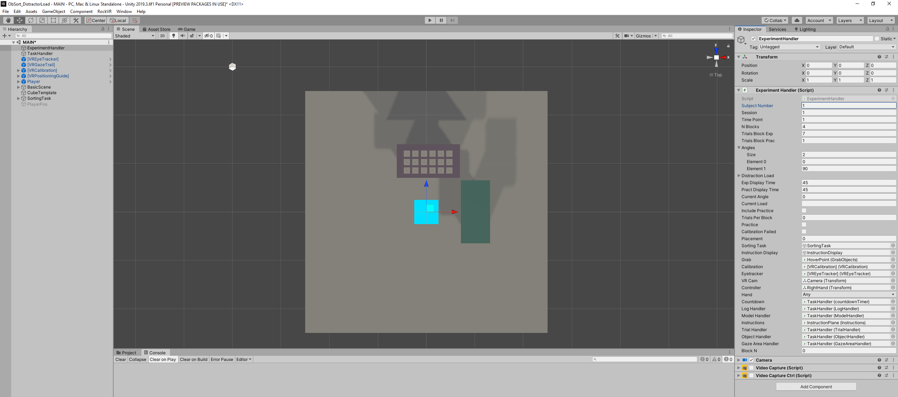
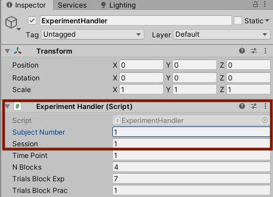

# Unity Interface
This section walks you through the Unity interface and how to navigate it in order to
enter participant details and simply run the task.
find relevant task objects and scripts in order to change task details. 

### Overview
So you have downloaded and opened the task in Unity. This means you should be faced with this interface: 

The panel on the left talk lists all task objects, which can be divided into different categories: 
- **Task flow:**  *ExperimentHandler* and *TaskHandler* are the core instances that oversees and controls the experimental flow. The ExperimentHandler controls the overall experimental sequence (e.g., block order, calibration procedure, etc. ) while the TaskHandler bundles scripts responsible of the trial sequence (e.g., trial set up, coordination of task objects and controller, data logging). 

- **VR environment:** Objects related to the overall VR space (e.g. walls, ground, lighting) are grouped under *BasicScene*. Model, Workspace and Resource area can be found in *SortingTask*. *CubeTemplate* is a placeholder object that will be used during trial set up as items in the Resource area. 

- **Player/ Eye-tracker:** All objects displayed in blue correspond to Vive and SteamVR and enable interaction with the task environment. 

### Running the task
To simply run the task with the trial/block specification explained above, all that has to be entered are subject and session number in the ExperimentHandler (see below). The task version available contains pre-made stimuli lists for 30 participants (i.e., subject numbers 1 to 30). Once specified, simply hit play! 
After the participant finished the first session, change session number to “2” and hit play again. 

