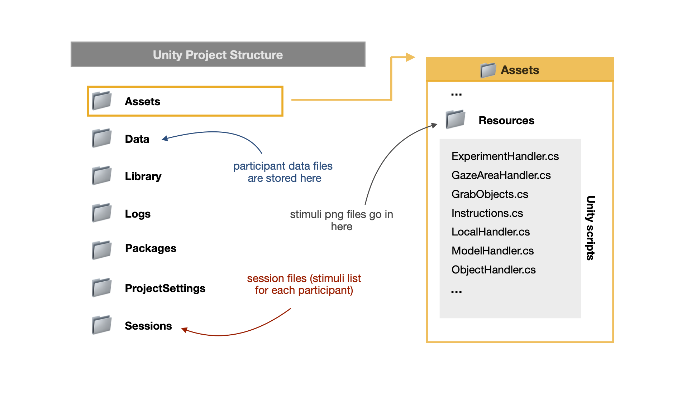

# Project Structure

This page gives an overview of the project file structure - so that when you want to run the task or start chaning small details you know where to look for the relevant things. 

### **Relevant Folders**
While the folder structure of any unity project can seem complex and confusing, there are a few folders of special importance on the ObjectSorting VR Task. We will go through them here now. If you are interested in just running the task yourself with none (or minimal) adjustment, the only folders of interest for you are:




#### 1. Data
This is the folder unity automatcically stores data files for each participant after running the task. 

```{admonition} Important
:class: warning
The path to that folder is specified in **LINK TO** LogHandler.cs. If you are changing the name of the main folder, make sure to also change the path in LogHandler.cs (line 321) so that the data file ends up where it belongs. 
```

#### 2. Sessions
This folder contains the session files (aka stimuli lists) for each participant. The task comes with 30 premade stimuli lists that you can reuse to run participants. However, in case you want to run more participants or modify the session files - check out **LINK TO** Session files. 

#### 3. Assets
This folder is especially important if you want to modify the task - almost all changes will occur in files in this folder. If you just want to rerun the task as described in LINK TO OVERVIEW, you can leave this folder untouched.  

First, there is the **Resource Folder**. This folder contains the stimuli files.   
Also, this folder contains the unity scripts (e.g. ExperimentHandler.cs) - those are the backbone of the task as they control the task behavior. Check out **LINK TO BEHIND THE SCENES** to learn more about those scripts and **LINK TO CHANGING PARAMETERS** for guidance on how and where to tweak task parameters. 


